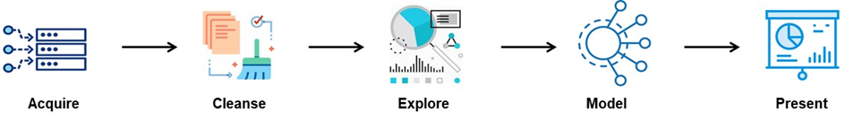

# `Heart Attack Prediction`
Heart Attack is a type of disease that affects the heart or blood vessels. The risk of certain heart diseases may be increased by smoking, high blood pressure, high cholesterol, unhealthy diet, lack of exercise, and obesity. `The main objective is to create an end-to-end Machine Learning Solution, on which if we give input data the ML Solution will provide us a result of:` **Whether the person has the Risk of Heart Attack or Not and with how much Certainity.** `So, that we can help the patient to identify the disease at the early stages.`

## `🎓Tech Stack`
  * Python
  * Pandas
  * Numpy
  * Matplotlib
  * Seaborn
  * Scikit-Learn
  * Jupyter Notebook
  * Kaggle
  
## `Data Science PIPELINE`

  

